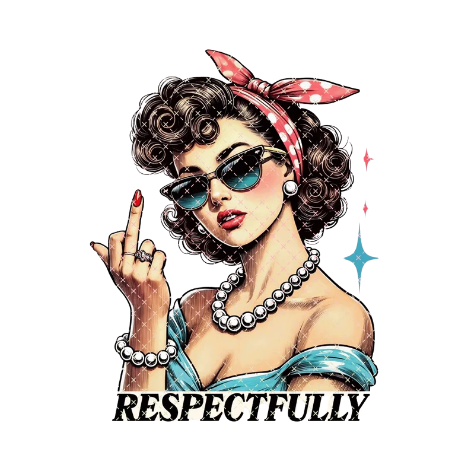

  

<h4>
    <a href="https://ezycdn.com/play.php?v=ie4oqpqc">ตัวอย่างสาธิต</a>
   · 
    <a href="#">Documentation</a>
   · 
    <a href="#">Report Bug</a>
   · 
    <a href="#">Request Feature</a>
  </h4>

 

<!-- Table of Contents -->

## 🎓 Ok, Coming Soon
- แนวทางการเรียนรู้การพัฒนาเว็บแอพพลิเคชั่น (Web Development) [อ่านบทความ](#)
- แนวทางการเรียนรู้สำหรับผู้เริ่มต้นพัฒนาเกม (Game Development) [อ่านบทความ](#)
- แนวทางการเรียนรู้สำหรับผู้เริ่มต้นพัฒนาแอพบน Android & iOS (Mobile Application) [อ่านบทความ](#)
- แนวทางการเรียนรู้สำหรับผู้เริ่มต้นเขียนโปรแกรมภาษา Python [อ่านบทความ](#)
- แนวทางการเรียนรู้สำหรับผู้เริ่มต้นเขียนโปรแกรมภาษา Java [อ่านบทความ](#)
- แนวทางการเรียนรู้สำหรับผู้เริ่มต้นเขียนโปรแกรมภาษา C# [อ่านบทความ](#)
- แนวทางการเรียนรู้สำหรับผู้เริ่มต้นเขียนโปรแกรมภาษา PHP [อ่านบทความ](#)
- บทความทั้งหมด [อ่านบทความ](#)

## 🔥 หลักสูตรฟรียอดนิยมบน 
- หลักสูตรก้าวแรกสู่การเขียนโปรแกรมภาษา Python [เข้าเรียน](#)
- หลักสูตรการพัฒนาเว็บแอพพลิเคชั่น (Frontend Development) [เข้าเรียน](#)
- หลักสูตรการพัฒนาเกมด้วยโปรแกรม Unity (Game Development) [เข้าเรียน](#)
- หลักสูตรการเขียนโปรแกรมด้วยภาษา Java (Basic & OOP) [เข้าเรียน](#)
- หลักสูตรก้าวแรกสู่ Data Science & Image Processing [เข้าเรียน](#)
- หลักสูตรก้าวแรกสู่ REST API (RESTful Web Services) [เข้าเรียน](#)
- หลักสูตรการเขียนโปรแกรมเชิงวัตถุ (Object Oriented Programming) [เข้าเรียน](#)
- หลักสูตรการพัฒนาเว็บแอพพลิเคชั่นด้วยภาษา PHP & Framework [เข้าเรียน](#)
- หลักสูตรการจัดการฐานข้อมูล (Database SQL & NOSQL) [เข้าเรียน](#)

## ⚙️ หลักสูตรที่จะเปิดให้เรียนฟรีเร็ว ๆ นี้ (Coming Soon)

<h2>👋 Netflix Chill</h2>

  
  &nbsp;&nbsp;
  
   
  
  &nbsp;&nbsp;
  
  

  
  
  
   
 

## :Sparesos: Contact

Your Name - [@Sparesos](https://twitter.com/Sparesos) - xxx@gmail.com

 

ตั้มมันร้าย!!!⭐️

